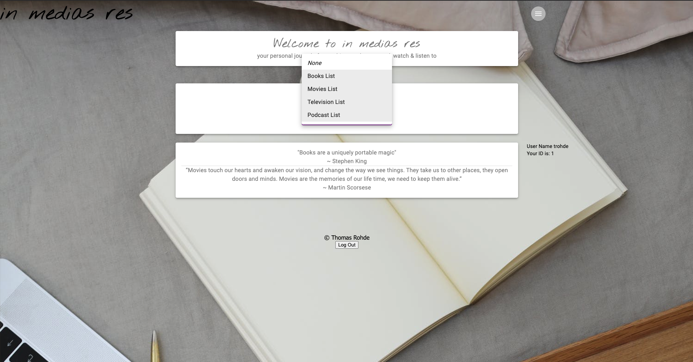

# in medias res

## Description

_Duration: 2 Week Sprint_

We all have things in our lives that we're passionate about and when we're passionate about something we will let our data nerd flag fly: fantasy football players will track players and stats, runners will track routes and miles, foodies will track recipes and restaurants, and gamers will have whole worlds that they are keeping track of. I track my media consumption. It started with the books I was reading each year and quickly blossomed to encompass the movies and television that I was watching and now the podcasts that I'm listening to. While some apps will let you keep track of some of these, none of them will let you track all of them and they all have a social media focus attached, which has the effect of putting a focus on reviews over reflection and comments over contemplation.

in medias res is a media journal app that addresses that by welcoming the user with a calming dashboard that easily allows the user to add entries to their journal, view their journal, and see cumulative lists of the books, movies, television, and podcasts that they've enjoyed. The app is desktop based, but mobile friendly, and designed to be easy to use.

To see the fully functional site, please visit: [in medias res](https://pure-brushlands-36686.herokuapp.com/#/user)

## Screen Shot

## Prerequisites

Before you get started, make sure you have the following software installed on your computer:

- [Node.js](https://nodejs.org/en/)
- [PostrgeSQL](https://www.postgresql.org/)
- [Nodemon](https://nodemon.io/)

## Installation

1. Create a database named `prime_app`,
2. The queries in the `database.sql` file are set up to create all the necessary tables and populate the needed data to allow the application to run correctly. The project is built on [Postgres](https://www.postgresql.org/download/), so you will need to make sure to have that installed. We recommend using Postico to run those queries as that was used to create the queries, 
3. Open up your editor of choice and run an `npm install`
4. Run `npm run server` in your terminal
5. Run `npm run client` in your terminal
6. The `npm run client` command will open up a new browser tab for you!

## Usage
How does someone use this application? Tell a user story here.

1. The user logs in or registers for an account on the landing page.
2. From the dashboard, the user may choose to add an entry, view their journal, or choose a list from media types to view.
3. When adding an entry, the user selects Add Entry, which brings them to the Add Entry page. They will select they type of media that they are adding to their journal, which will trigger a Dialog to pop up with the relevant form. Once the user fills in the form, the entry will be added to the users journal and the user will be returned to the dashboard.
4. When viewing the journal, the user selects Your Journal, which brings the user to the journal page. They may select the date they wish to view, which expands the accordion for that day and shows cards with each entry (category of media, title, and accompanying details). Each card also has buttons to Edit or Delete the entry.
5. Returning to the Dashboard, the user may choose a media category from the Select menu and view all completed items on that list. Once a user marks a book, movie, television show, or podcast as "finished" it's immediately added to that list!
6. The Dashboard, Journal, and Add Entry pages are also easily accessible from the hamburger menu in the top right corner of every page.

## Built With

This application uses the following technologies:

- [React](https://reactjs.org/)
- [Redux](https://maven.apache.org/)
- [Redux-Sagas](https://redux-saga.js.org/)
- [Express](https://expressjs.com/)
- [PostgreSQL](https://www.postgresql.org/)
- [Material-UI](https://material-ui.com/)

(a full list of dependencies can be found in `package.json`)

## Acknowledgement
Thanks to [Prime Digital Academy](www.primeacademy.io) who equipped and helped me to make this application a reality. (Thank your people)

## Support
If you have suggestions or issues, please email me at rohde.t@gmail.com or find me at [theThomasRohde.com](www.theThomasRohde.com)
